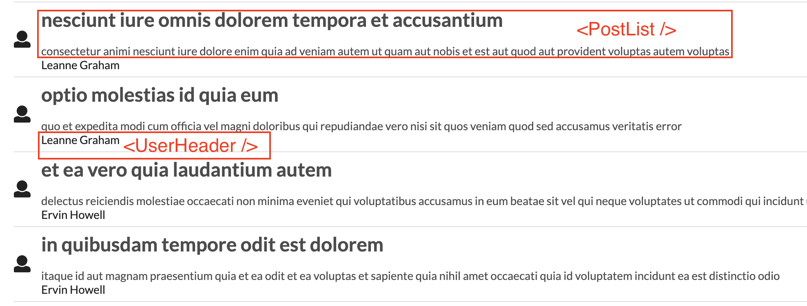

### Overview

A simple app which renders a list of blog posts drawn from an API (dummy JSON data).



Key concepts:

- General use of Redux

  1.  Store object contains Reducers
  2.  Store is passed as a prop to Provider
  3.  Provider wraps around App
  4.  React-redux _connect()_ is used to connect components to the store; _mapStateToProps_ transforms the store's state into the props to be passed to the component
  5.  App renders a component
  6.  _ComponentDidMount_ lifecycle method is called
  7.  Action Creator is called to fetch data
  8.  Action Creator creates an Action object, which has a type and payload
  9.  Action is dispatched
  10. Reducers receive Actions (and previousState) and return newState
  11. Reducers are pure functions; make API calls in Action Creators, not Reducers
  12. Do not mutate state object in a Reducer, create new objects instead
  13. If the state object has been modified, the App will be re-rendered

- Redux Action Creators can only return Actions (objects), so a Redux store can only complete _synchronous_ updates. This means Action Creators cannot handle async calls, eg. AJAX requests like fetch().
- Use Redux Thunk (middleware) for Action Creators which return a function. Thunk delays the dispatch of the action to when the async function has returned.
- An Action Creator can call other Action Creators. This is a design consideration which can avoid making multiple repeated requests for the same resource each time a component is rendered.

### Instructions

```bash
npm i
npm start
```

The app runs on http://localhost:3000.
